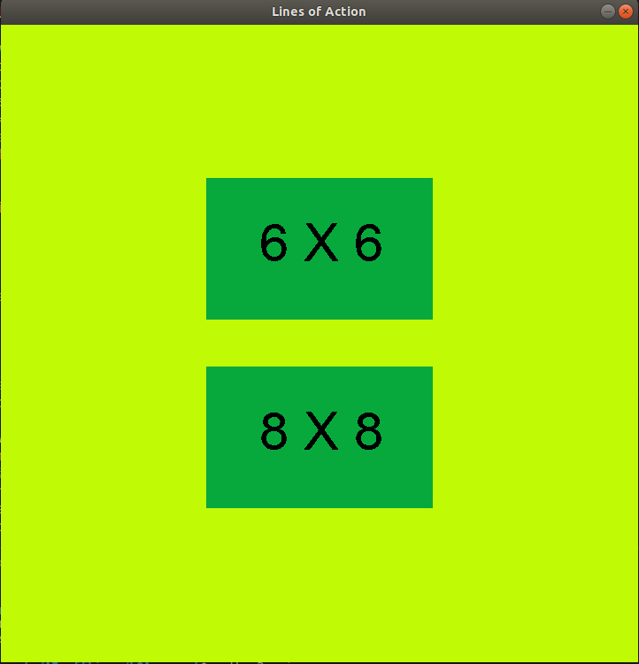
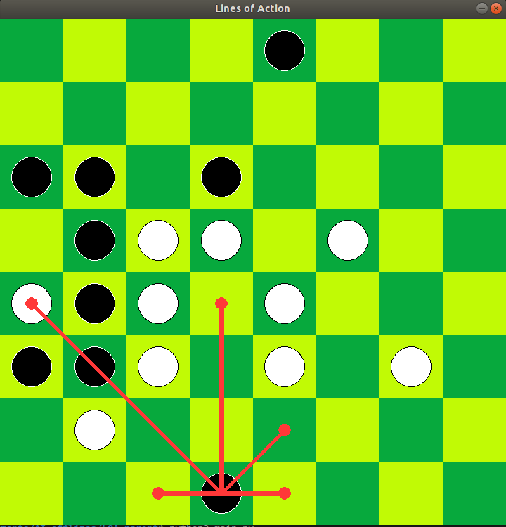
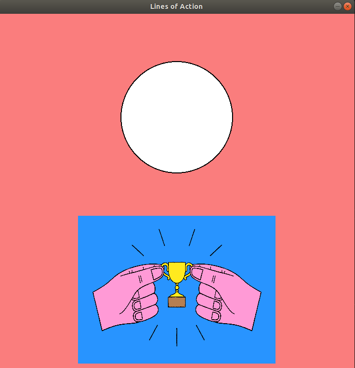

<!-- TABLE OF CONTENTS -->
<details open="open">
  <summary>Table of Contents</summary>
  <ol>
    <li>
      <a href="#about-the-project">About The Project</a>
      <ul>
        <li><a href="#built-with">Built With</a></li>
      </ul>
    </li>
    <li>
      <a href="#getting-started">Getting Started</a>
      <ul>
        <li><a href="#prerequisites">Prerequisites</a></li>
        <li><a href="#installation">Installation</a></li>
      </ul>
    </li>
    <li><a href="#usage">Usage</a></li>
  </ol>
</details>


<!-- ABOUT THE PROJECT -->
## About The Project

I recreated an abstract strategy board game named [Lines of Action](https://cutt.ly/QhTCLUH "Lines of Action-Wikipedia"). It is a zero-sum game which comprises the area of adversarial search in artificial intelligence. 

Features:
* Playable in 
    * 6 X 6 Board
    * 8 X 8 Board
* Human vs Human mode
* Human vs AI mode
    * AI best move upto depth 3 (default) (change it as your wish)
    * MiniMax Algorithm
    * Alpha-Beta pruning

### Built With

* [Python 3](https://www.python.org/)
* [Pygame](https://www.pygame.org/news)


<!-- GETTING STARTED -->
## Getting Started

Just clone or download the project on your local machine. Make sure your machine have python 3. My python version is `Python 3.6.9`

### Prerequisites

* pygame


### Installation

From this folder (`Lines-of-Action-master/`), create a venv and install dependencies (recommended):

```sh
cd Lines-of-Action-master
uv venv
source .venv/bin/activate   # Windows: .venv\Scripts\activate
uv pip install -r requirements.txt
```

Or use system Python:

Ubuntu
```sh
sudo apt-get install python3-pygame
```
Windows
```sh
py -m pip install -U pygame --user
```
Mac
```sh
python3 -m pip install -U pygame --user
```

**Win screen image (optional):** place `wins3.png` under `Lines-of-Action-master/images/`. If it is missing, the game still runs and shows a text win message instead.

<!-- USAGE EXAMPLES -->
## Usage

Run **from the `Lines-of-Action-master` directory** (so imports and asset paths resolve correctly):

```sh
cd Lines-of-Action-master
python3 main.py
# or: uv run python main.py
```

Pick a board size 

<!--  -->


Start the game. Black moves first. Human is playing as Black, AI is White.
Change the following in `constants.py` to change to Human vs Human mode.
```python
AImode = False
```

<!--  -->


White (AI) eventually wins this game.

<!--  -->


It's a part of the offline evaluation (assignment) of CSE 408 course in CSE, BUET.


